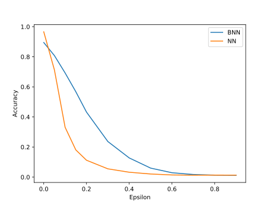
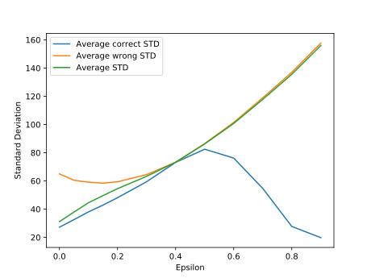
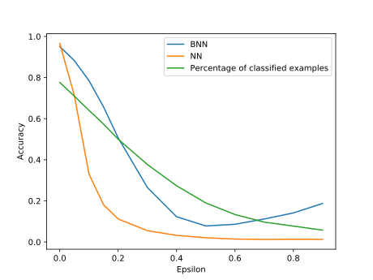

# Description
This project is a comparison of the impact the Fast Gradient Sign Method
(FSGM) attack has on a Deep Neural Network and a Bayesian Neural Network.
Both networks use the same architecture that consists of an input layer, 
one hidden layer with the size 1024 and an output layer. Both networks
are defined in the [networks](networks.py) script. The project is entirely 
implemented in [Pytorch](https://pytorch.org/) and [Pyro](https://pyro.ai/) 
and uses the MNIST data set as a reference.

# Dependencies
You can install all required dependencies with: 

``pip install -r requirements.txt``

# How it works
First, you have to train both neural networks. Therefore you have to execute
the following scripts:
1. [nn_trainer.py](nn_trainer.py) (Accuracy should be around ~96%)
2. [bnn_trainer.py](bnn_trainer.py) (Accuracy should be around ~89%)

After this, you can run the attack on the MNIST test set. In order to do this
execute the following scripts:
3. [nn_adversary](nn_adversary.py)
4. [bnn_adversary](bnn_adversary.py)

Now the results from the attack should be saved as CSV files in the ``data``
folder. In order to visualize the results run the following script:
5. [visualizer](visualizer.py)

# Results
In the following graph, you can see the accuracy of both networks in
dependence of epsilon, the strength of the attack. You can see that
both networks are vulnerable to the FGSM attack whereas the BNN is a 
little bit more robust.

The advantage of using a Bayesian Neural Network is that we can compute
a model uncertainty by evaluating an input several times. In the following 
graph, we can see that the average model uncertainty is increasing with 
the strength of the attack. 

If we use the model uncertainty to allow the network not to classify examples
where the standard deviation is high, we can improve the accuracy even under 
FGSM attacks. But on the green line we can see that the percentage of classified 
examples is getting small with big epsilons.

